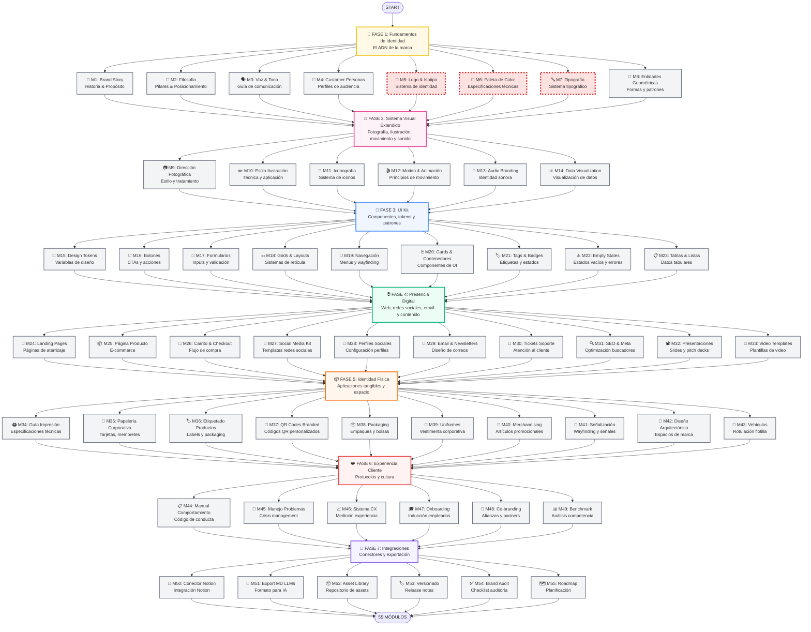
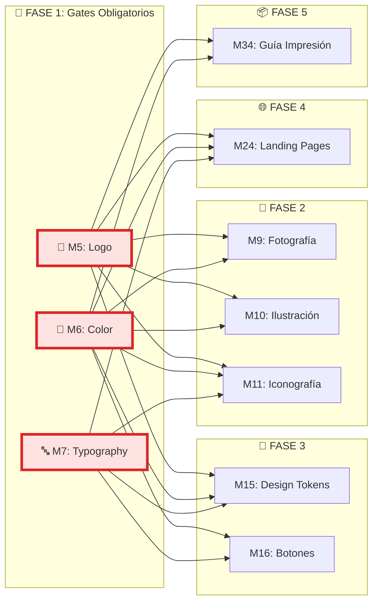
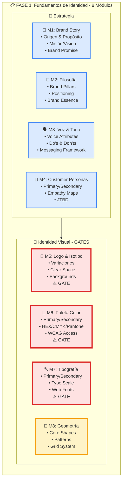
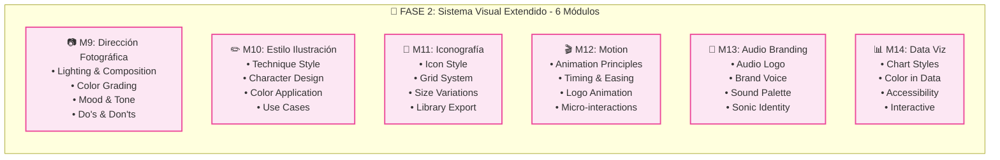
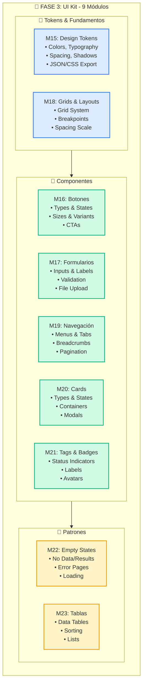
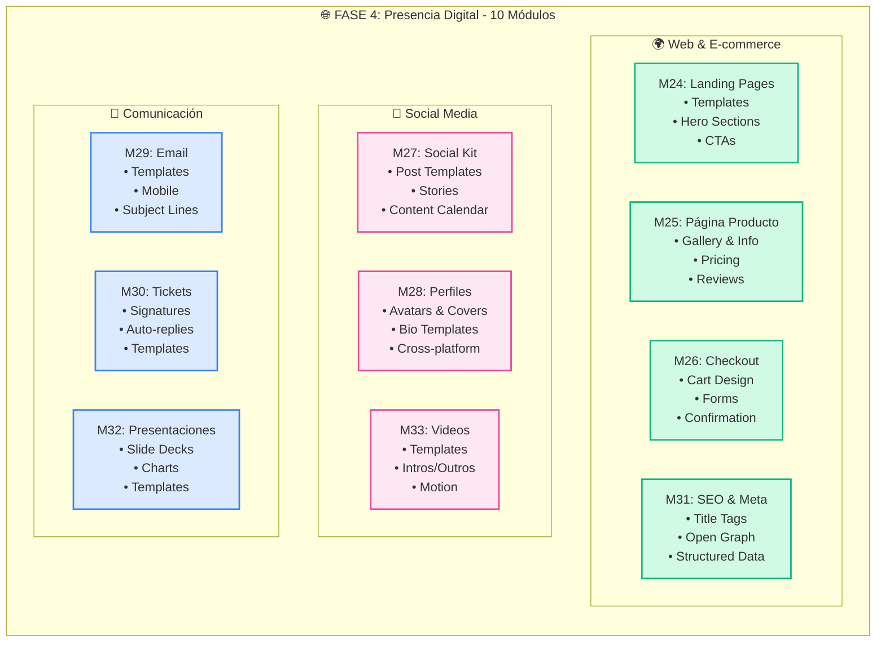
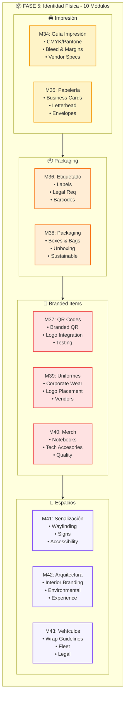
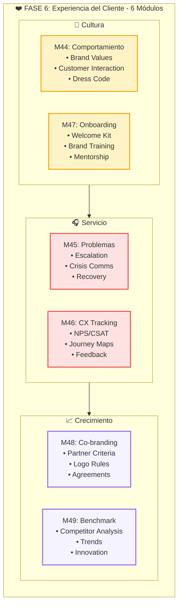
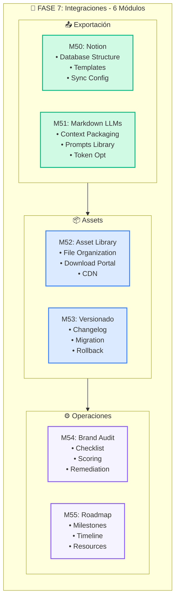
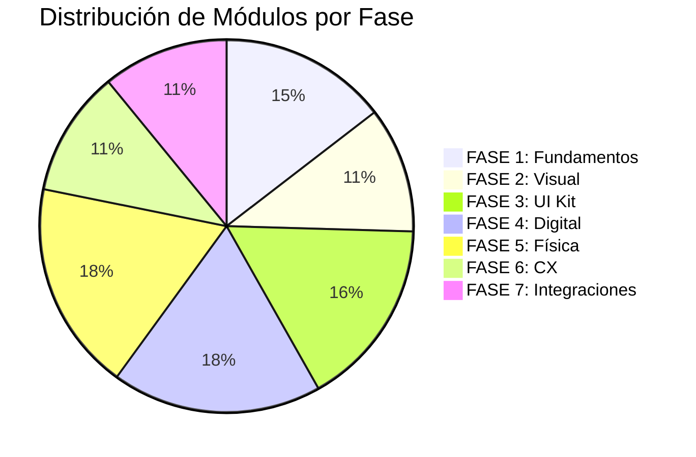

# Brand Manual Development Roadmap

## Diagrama General de Flujo

---

## Diagrama de Dependencias Críticas (Gates)

---

## Diagrama por Fase - FASE 1 Detalle

---

## Diagrama por Fase - FASE 2 Detalle

---

## Diagrama por Fase - FASE 3 Detalle

---

## Diagrama por Fase - FASE 4 Detalle

---

## Diagrama por Fase - FASE 5 Detalle

---

## Diagrama por Fase - FASE 6 Detalle

---

## Diagrama por Fase - FASE 7 Detalle

---

## Resumen de Métricas

---

## Leyenda de Códigos

| Icono | Significado |
|-------|-------------|
| 🎨 | Identidad Visual |
| 📖 | Contenido Estratégico |
| 🧩 | Componentes UI |
| 🌐 | Digital/Web |
| 📦 | Físico/Tangible |
| ❤️ | Experiencia/Operaciones |
| 🔌 | Integraciones |
| ⚠️ | Gate Obligatorio |

---

**Total: 55 Módulos | 7 Fases | 3 Gates Críticos (M5, M6, M7)**
